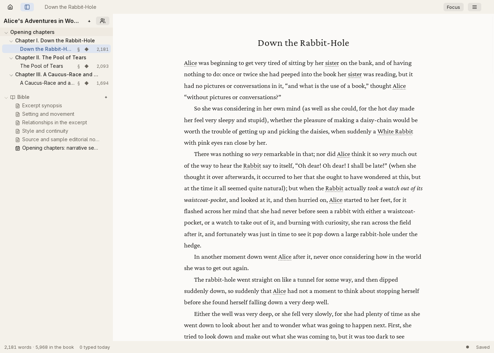
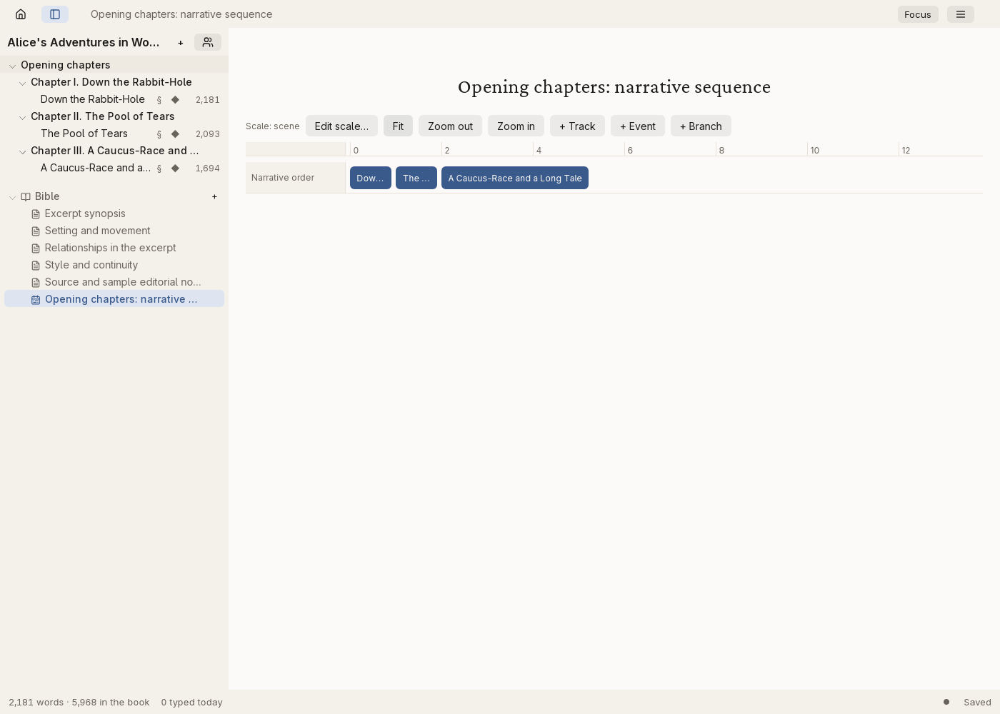
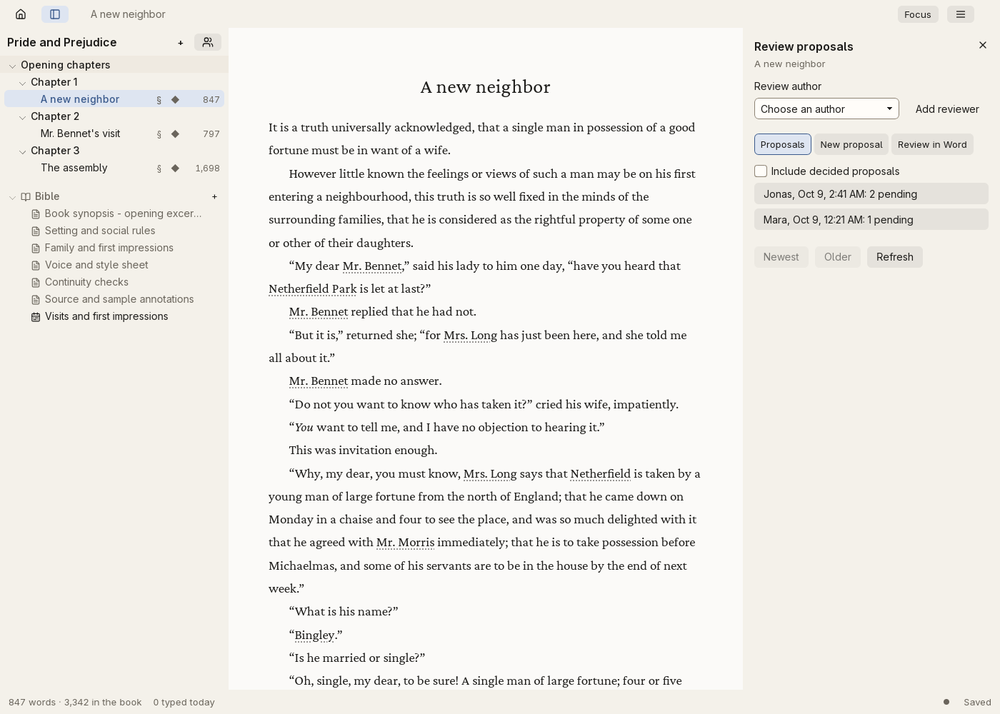
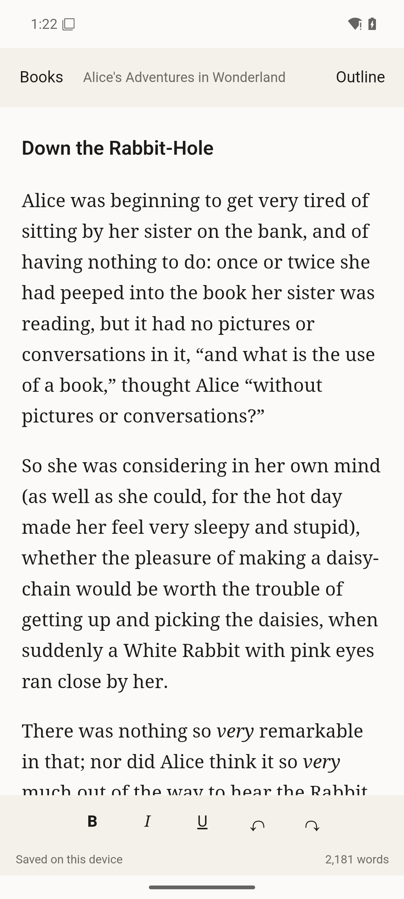
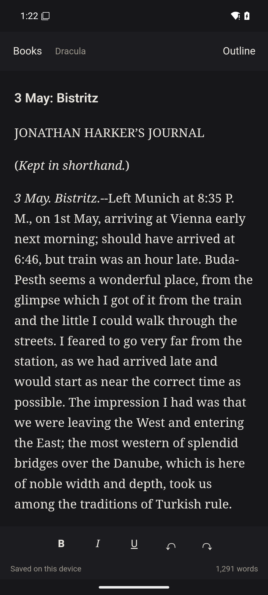

<p align="center">
  <picture>
    <source media="(prefers-color-scheme: dark)" srcset="assets/brand/garret/garret-wordmark-paper.png">
    
  </picture>
</p>

## A writing studio for the whole book.

**garret**  is a powerful writing studio for novelists, completely free and open
source. It brings your manuscript, story planning, research, and revisions
into one app.

There are no subscriptions or paid feature unlocks. You don't need an account
or an internet connection to write. Your books stay on your own disk.

> **Early alpha.** garret moves fast; keep backups of your work.

The current published build is [0.0.2 alpha](https://github.com/iuliandita/garret/releases/tag/v0.0.2).
See [published and development changes](docs/RELEASES.md) and the
[compatibility and rollback guide](docs/COMPATIBILITY.md).



[Website](https://usegarret.com) | [Full screenshot gallery](docs/screenshots/README.md) | [Sample books](app/fixtures/classics/README.md)

## Write, plan, and revise

Write in a calm editor with formatting, book-wide search, undo/redo, and
scene history. Arrange parts, chapters, and scenes with outlines and cards.
Choose light or dark mode, in English or German.

### Keep the story straight

Build a story bible for your world, notes, and continuity rules. Keep character
profiles, aliases, pictures, and appearances alongside your manuscript. Write
scene synopses, connect research files, and use the timeline to follow events
across character and story tracks.



### Work with your editor

Send a DOCX review document to your editor and import the returned changes
with attribution. Accept or reject proposals in garret, keep comments attached
to the text, and organize the next draft into revision passes and tasks.



### Prepare the book

Export to Markdown, DOCX, or EPUB, or make a PDF proof copy. Set up book design,
front and back matter, covers, and pen names before exporting.

### Keep control of your work

Books live on your own disk. Recovery copies, scene history, salvage tools,
and a readable mirror folder help you recover work. Encrypted portable archives
include a separate recovery key. An optional PIN lock conceals the app when
you step away; it does not encrypt manuscript files.

Series, optional session analytics, and local craft and consistency reports
are included too. All of these tools are free.

## Platforms

| Platform | |
| --- | --- |
| Linux | x86_64, glibc 2.39+, WebKitGTK 4.1 |
| Windows | x86_64, WebView2 |
| Android | Writing and editing on the go |
| macOS | Apple Silicon and Intel alpha builds; native testing needed |

Get [alpha testing builds from GitHub Releases](https://github.com/iuliandita/garret/releases),
or [build garret from source](#building-from-source-linux).

<p>
  
  
</p>

## Testing builds

Download alpha builds from [GitHub Releases](https://github.com/iuliandita/garret/releases).
Choose the download for your device, extract the whole desktop package, and
follow the included instructions. Android uses an APK; the phone app has fewer
features and does not sync books automatically. Keep a backup before trying a
new build.

## Building from source (Linux)

You need [Bun](https://bun.sh), a stable Rust toolchain, and the
[Tauri 2 Linux prerequisites](https://v2.tauri.app/start/prerequisites/#linux)
(WebKitGTK 4.1 development packages).

```sh
bun install
cd app/ui && bun run build && cd -
cd app/shell-tauri/src-tauri && cargo build --release && cd -
scripts/run-app
```

`scripts/run-app` rebuilds the interface, builds the host on first use, and
starts the app. `scripts/install-desktop-entry` adds a menu entry for that
launcher. Release-style packages come from `scripts/package-linux`,
`scripts/package-windows`, `scripts/package-macos` and `scripts/package-android`.

## Checks

See [CONTRIBUTING.md](CONTRIBUTING.md) for development setup, checks, and
pull request instructions.

## Where your work lives

New books default to `Documents/Books` until you choose another folder.
On Linux, settings and recovery copies default to `~/.local/share/garret/`.
Migrated profiles retain a compatibility link at the former `cc.local.app`
location. Pictures and research originals sit next to each book, so back up a book's
`.db` file together with those folders, with the app closed.

If garret stops while preparing its application data, keep both folders named in
the warning. Close every version of garret and back up both folders separately
before attempting recovery. Do not delete, merge or overwrite either folder.
Request recovery help and include the warning, removing personal paths before
posting it publicly. A symbolic link inside the old profile also stops the move;
garret does not follow it or remove it for you.

### Keep a safe copy of your book

Keep your working book outside cloud-synced folders. **File > Copies > Create recovery point** makes a
local recovery copy; it cannot protect your work if you lose the device.

1. Open **File > Copies > Encrypted backups**.
2. Choose **Create recovery key** and keep the key separately from your backups.
   A lost key means you cannot restore an encrypted archive.
3. Select **Choose backup folder**, then **Make encrypted archive** and save
   the archive there. Use a Google Drive or Dropbox synced folder, or a USB
   drive. You can also copy the archive there afterward.
4. Use **Verify encrypted archive** to check the saved archive with your key.

garret remembers the backup destination folder. Making and saving each archive
is manual. **Restore encrypted archive** restores it as a separate book.

### If a backup was interrupted

Open the error's **Details** for the exact parent directory and retained folder.
Close garret, preserve a local copy of that folder, and inspect it first.
Application-private temporary files may contain unencrypted writing; keep them
out of cloud folders. To list retained folders, replace the placeholders below
with the parent directory and folder name from Details:

```sh
garret archive-stage-list "<parent-dir>"
```

Only after inspecting and preserving the selected folder, deliberately discard
its temporary files with:

```sh
garret archive-stage-clean "<parent-dir>" "<stage-name>"
```

Then retry the backup. For destination temporary encrypted files, choosing another
backup folder also works while keeping the retained files. Another filename in
the same folder does not help. Changing the backup folder cannot bypass retained
application-private files.

## Support garret

If you would like to support development, you can
[leave a tip on Ko-fi](https://ko-fi.com/Q3O027XM2F). It is entirely optional;
every feature remains free.

## License

garret is free software under the GNU General Public License, version 3 or
later; see [COPYING](COPYING). Third-party notices are in
[THIRD-PARTY-NOTICES.md](THIRD-PARTY-NOTICES.md).
